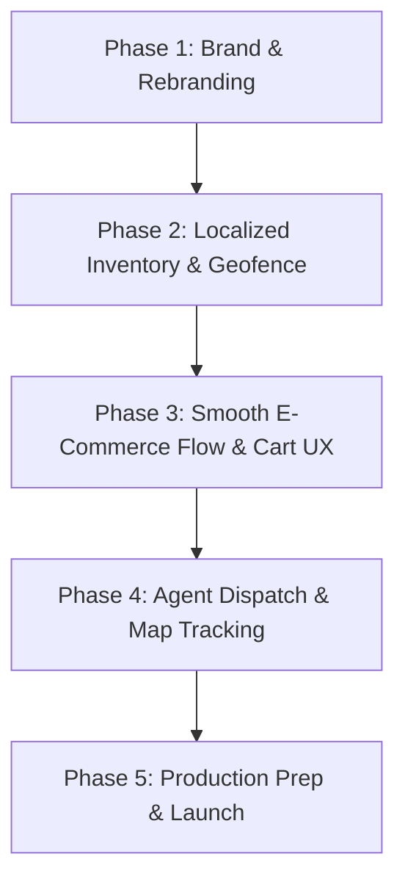

# Loopers: Quick Commerce Project Audit & Transformation Blueprint

This document provides a detailed audit of the existing codebase (formerly *InstaDispatch*) and outlines the architectural changes, optimizations, and features required to transform it into **Loopers**, a smooth, robust, and lightning-fast quick commerce platform (similar to Blinkit or Zepto) tailored for 300–500 customers per week in a localized area.

---

## 1. Executive Summary

The existing codebase is structured as a **Hyperlocal Delivery Dispatcher** featuring a Node.js/Express backend (with Mongoose & Socket.io) and a React/Redux frontend styled with Tailwind CSS. It already contains key building blocks for a delivery platform:
- **Authentication**: Email/password authentication, JWT-based access/refresh token rotation, and distinct roles (`customer`, `delivery_agent`, `admin`).
- **Catalog & Cart**: Basic product storage, dynamic cart management, and checkout.
- **Real-Time Communication**: WebSockets (`socket.io`) for order status updates and agent location streaming.
- **AI Smart Assistant**: Built-in integrations with Gemini and Groq to allow AI-guided grocery recommendations or natural language ordering.

### Current Suitability for "Loopers"
For a small-scale quick commerce platform processing ~50–80 orders daily (300–500 per week), the current stack (React + Node.js + Express + MongoDB) is highly appropriate. It keeps server costs low, development velocity high, and is easily capable of handling a peak throughput of several concurrent requests. 

However, to pivot from a generic *delivery dispatcher* to a high-utility *quick commerce platform*, we need to address several gaps in **inventory management (Dark Stores)**, **geofencing/delivery radius limits**, **seamless UI/UX flows**, and **order fulfillment automation**.

---

## 2. Directory Structure Audit

Below is a breakdown of the existing directories and files:

### Backend Structure (`/hyper_local_delivery_dispatcher/backend`)
*   `server.js` — App entry point. Sets up Express middleware, registers routes, initializes the Socket.io server, and connects to MongoDB.
*   `/config/db.js` — MongoDB connection utility using Mongoose.
*   `/models/` — MongoDB Schemas:
    *   `User.js` — Standard user data, stored delivery addresses, and roles.
    *   `Product.js` — Product metadata (name, description, price, category, image, stock count).
    *   `Cart.js` — Per-user cart items linked to products.
    *   `Order.js` — Order status (`pending`, `assigned`, `picked_up`, `delivered`), pricing, address, payment status, and assignment timestamps.
    *   `DeliveryAgent.js` — Active status, current lat/lng location, and approval status.
    *   `AISearch.js` — Logged queries and interactions with the AI assistant.
*   `/controllers/` — Business logic controllers for routes (auth, admin, ai, cart, dispatch, order, product).
*   `/routes/` — Endpoint definitions matching the controllers.
*   `/middleware/` — Express security and token verification middlewares (`auth.js`).
*   `/services/` — Core helper modules (e.g., `dispatchService.js` handling WebSocket-based driver assignment).

### Frontend Structure (`/hyper_local_delivery_dispatcher/frontend`)
*   `vite.config.js` & `tailwind.config.js` — Modern Vite tooling and Tailwind configuration.
*   `/src/main.jsx` & `App.jsx` — React root components, routing definitions, global toaster, and Redux provider wrapper.
*   `/src/store/` — Redux state management (slices for `auth`, `cart`, `orders`, `products`).
*   `/src/pages/` — Page components:
    *   `LandingPage.jsx` — Entry landing.
    *   `LoginPage.jsx` & `SignupPage.jsx` — User onboarding.
    *   `AIShoppingPage.jsx` & `AISearch.jsx` — AI-powered natural language shopping dashboard.
    *   `DashboardPage.jsx` — Central landing for logged-in users, branching into Client/Agent/Admin view layouts.
    *   `CartPage.jsx`, `CheckoutPage.jsx`, `PaymentPage.jsx` — E-commerce purchasing funnel.
    *   `OrderTrackingPage.jsx` — Leaflet Map tracking of active orders.
    *   `AdminDashboard.jsx` & `AgentDashboard.jsx` — Special role management views.
*   `/src/components/` — Reusable components (buttons, badges, inputs, loaders, item cards).

---

## 3. Technology Stack Analysis & Recommendations

| Technology Layer | Existing Tech | Loopers Recommendation | Rationale |
| :--- | :--- | :--- | :--- |
| **Backend Framework** | Node.js + Express | **Retain (Express)** | Lightweight, highly extensible, and handles asynchronous WebSockets flawlessly. |
| **Database** | MongoDB + Mongoose | **Retain (MongoDB)** | Document-oriented schemas are perfect for product listings with flexible attributes (e.g., weights, categories, dietary info). |
| **Real-time Engine** | Socket.io | **Retain (Socket.io)** | Excellent for pushing live order status updates (e.g., *Picked Up*, *Near You*) and driver location coordinates. |
| **State Management**| Redux Toolkit | **Retain (Redux)** | Standard and stable for caching cart status, order logs, and auth sessions globally. |
| **Mapping & Location**| Leaflet / React-Leaflet | **Retain + Geolib** | Leaflet is open-source (no API keys required). Add `geolib` on the backend to enforce delivery radius checks. |
| **Styling** | Tailwind CSS | **Enhance CSS / Theme** | Customize theme variables (colors, borders, shadows) to deliver a modern, dark-mode/glassmorphic quick-commerce brand. |

---

## 4. Key Gaps & Architectural Recommendations

To transform this dispatcher into a premium, smooth **Blinkit/Zepto** clone, we must implement the following changes:

### A. Dark Store / Local Warehouse Architecture
*   **Gap**: Currently, products exist globally without relation to specific locations or warehouses. Quick commerce relies on hyper-local delivery from a specific nearby "Dark Store".
*   **Proposal**: 
    1.  Add a `Store` model representing micro-warehouses (Name, Lat/Lng coordinates, Address, Active Status).
    2.  Update the `Product` schema to track store-specific inventory (`storeInventories: [{ storeId, stock }]`) instead of global stock.
    3.  During user onboarding/app initialization, request the user's current location, find the nearest active dark store (using Haversine/Geo-spatial queries), and display only products available in that nearest store.

### B. Geofencing & Delivery Limitations (1-3 KM Radius)
*   **Gap**: A quick commerce delivery model guarantees delivery under 10–15 minutes, which is impossible if the customer is located 10 kilometers away.
*   **Proposal**:
    1.  Add a geofencing check. When the user sets their address on the checkout/cart page, calculate the distance between the selected address and the serving Dark Store.
    2.  If the distance exceeds a threshold (e.g., 3 km), display a friendly message: *"We do not serve this location yet! Loopers is currently expanding."* and prevent order placement.

### C. Live Delivery ETA and Dynamic Status Tracker
*   **Gap**: Customers expect step-by-step transparency (e.g., *Order Accepted* -> *Packing Items* -> *Partner Dispatched* -> *Arrived*). The current tracking page needs a simplified and beautiful visual checklist.
*   **Proposal**:
    1.  Design a smooth, micro-animated status stepper in the frontend (`DeliveryTracker.jsx`).
    2.  Implement an estimated time of arrival (ETA) counter that counts down dynamically (e.g., starting at 12 minutes).

### D. Visual Polish, Brand Makeover & Smooth UI/UX
*   **Gap**: The layout is named "InstaDispatch" and has generic corporate blue/green branding. Quick commerce apps demand energetic, vibrant colors (like Blinkit's bright yellow/green or Zepto's deep purple/orange) and ultra-smooth interface feedback.
*   **Proposal**:
    1.  Rename branding assets, headers, page titles, and meta tags to **Loopers**.
    2.  Introduce dynamic micro-animations (using `framer-motion`) when adding items to the cart, displaying checkout transitions, and viewing the order success screen.
    3.  Introduce modern typography (Google Font like *Outfit* or *Inter*).

---

## 5. Phased Implementation Roadmap

To build this systematically, we suggest the following phases:

### Phase 1: Rebranding & Visual Makeover
*   Update metadata, index headers, page names, and colors to match the new **Loopers** identity.
*   Refurbish layout headers, sidebars, and navbars. Ensure an aesthetic, premium dark-mode or bright modern layout with rich accents.
*   Inject CSS micro-animations into buttons, cart counts, and alerts.

### Phase 2: Geolocation & Nearest Store Filter
*   Introduce backend checks using coordinates to map users to their closest storefront.
*   Ensure users cannot place orders outside the delivery range.

### Phase 3: Seamless Cart, Stock Control, and Quick Checkout
*   Optimize the cart adding/removing speed.
*   Include order summaries, delivery tips, and localized charges.
*   Create a simulated payment screen with satisfying success animations.

### Phase 4: Driver Auto-Assign & Real-Time Tracking
*   Tune the Socket.io connection to guarantee zero-latency coordinate updates.
*   Implement auto-accept/auto-assign logic for Delivery Agents to simulate a live dispatcher.
